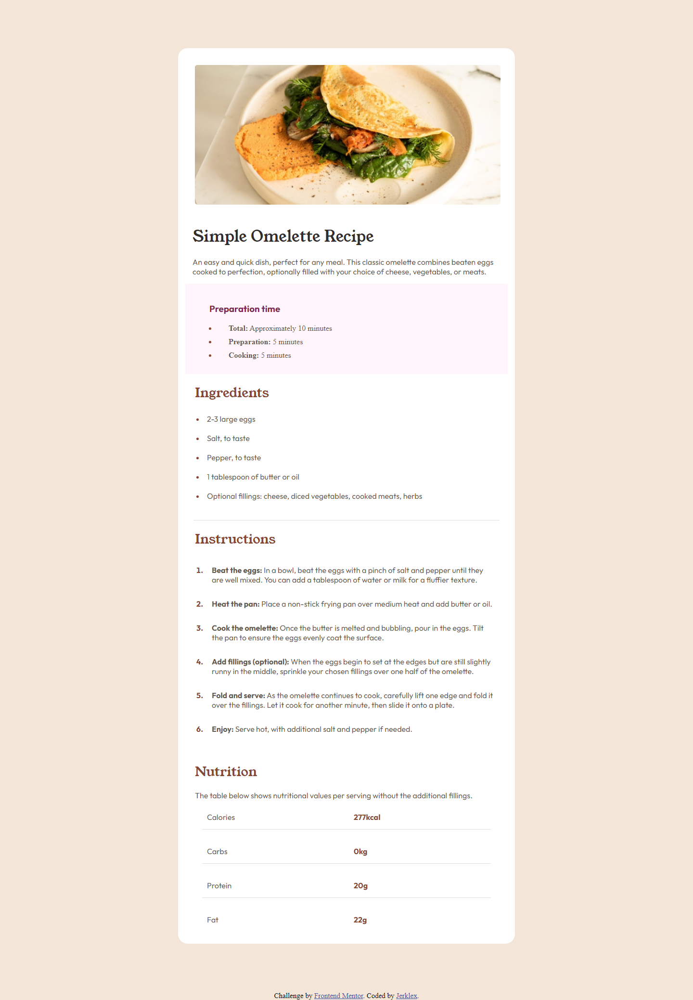

# Frontend Mentor - Recipe page Çözümü

Bu, [Frontend Mentor'daki Tarif Sayfası zorluğuna](https://www.frontendmentor.io/challenges/recipe-page-KiTsR8QQKm) bir çözümdür. Frontend Mentor zorlukları, gerçekçi projeler oluşturarak kodlama becerilerinizi geliştirmenize yardımcı olur.

## İçindekiler
- [Genel Bakış](#genel-bakış)
  - [The challenge](#the-challenge)
  - [Ekran Görüntüsü](#ekran-görüntüsü)
  - [Bağlantılar](#bağlantılar)
- [Süreç](#Süreç)
  - [Kullanılar Teknolojiler](#kullanılar-teknolojiler)
  - [Neler Öğrendim](#neler-öğrendim)
  - [Devam eden gelişim](#devam-eden-gelişim)
  - [Faydalı kaynaklar](#faydalı-kaynaklar)
- [Yazar](#yazar)
- [Teşekkürler](#teşekkürler)

## Genel Bakış

### Ekran Görüntüsü



### Bağlantılar

- Solution URL: [Add solution URL here](https://github.com/jerklex/recipe-page-main)
- Live Site URL: [Add live site URL here](https://jerklex.github.io/recipe-page-main/)

## Sürecim

### Kullanılan Teknolojiler

- Semantik HTML5 etiketleme
- CSS özel özellikleri
- Flexbox
- CSS Grid
- Mobil öncelikli yaklaşım

### Öğrendiklerim

Kod snippet'lerini eklemek için aşağıdaki örnekleri kullanabilirsiniz:

```html
<ol class="instructions-list">
          <li><span><strong>Beat the eggs:</strong></span><span>
            In a bowl, beat the eggs with a pinch of salt and pepper until they are well mixed. 
  You can add a tablespoon of water or milk for a fluffier texture.</span></li>

<li><span><strong>Heat the pan:</strong></span><span>
  Place a non-stick frying pan over medium heat and add butter or oil.
</span></li>

<li><span><strong>Cook the omelette:</strong></span><span>
  Once the butter is melted and bubbling, pour in the eggs. Tilt the pan to ensure 
  the eggs evenly coat the surface.</span></li>

  <li><span><strong>Add fillings (optional):</strong></span><span>
    When the eggs begin to set at the edges but are still slightly runny in the 
  middle, sprinkle your chosen fillings over one half of the omelette.</span></li>

  <li><span><strong>Fold and serve:</strong></span><span>
    As the omelette continues to cook, carefully lift one edge and fold it over the 
  fillings. Let it cook for another minute, then slide it onto a plate.
</span></li>

<li><span><strong>Enjoy:</strong></span><span>
  Serve hot, with additional salt and pepper if needed.</span></li>


        </ol>
```
```css
.nutrition-container :nth-last-of-type(1){
    border:none
}
.nutrition-container-item{
    color: var(--muted-brown);
    font-family: var(--font2);
    padding: 0px 10px 0px;
    display: flex;
    margin: 10px 35px;
    align-items: center;
    border-bottom: 1px solid var(--light-beige);
}
```
### Devam Eden Gelişim

Daha fazla projeye katılıp farklı kütüphaneler öğrenmeyi ve kendimi daha fazla geliştirmeyi planlıyorum.

### Faydalı Kaynaklar

- [Frontend Mentor](https://www.frontendmentor.io/) - Gerçek dünya projeleriyle pratik yapma fırsatı sunan harika bir platform.

## Yazar

- Frontend Mentor - [@jerklex](https://www.frontendmentor.io/profile/jerklex)
- github - [@jerklex](https://github.com/jerklex)

## Teşekkürler

Bu projede size yardımcı olan kişilere teşekkür etmek için bu bölümü kullanabilirsiniz.
